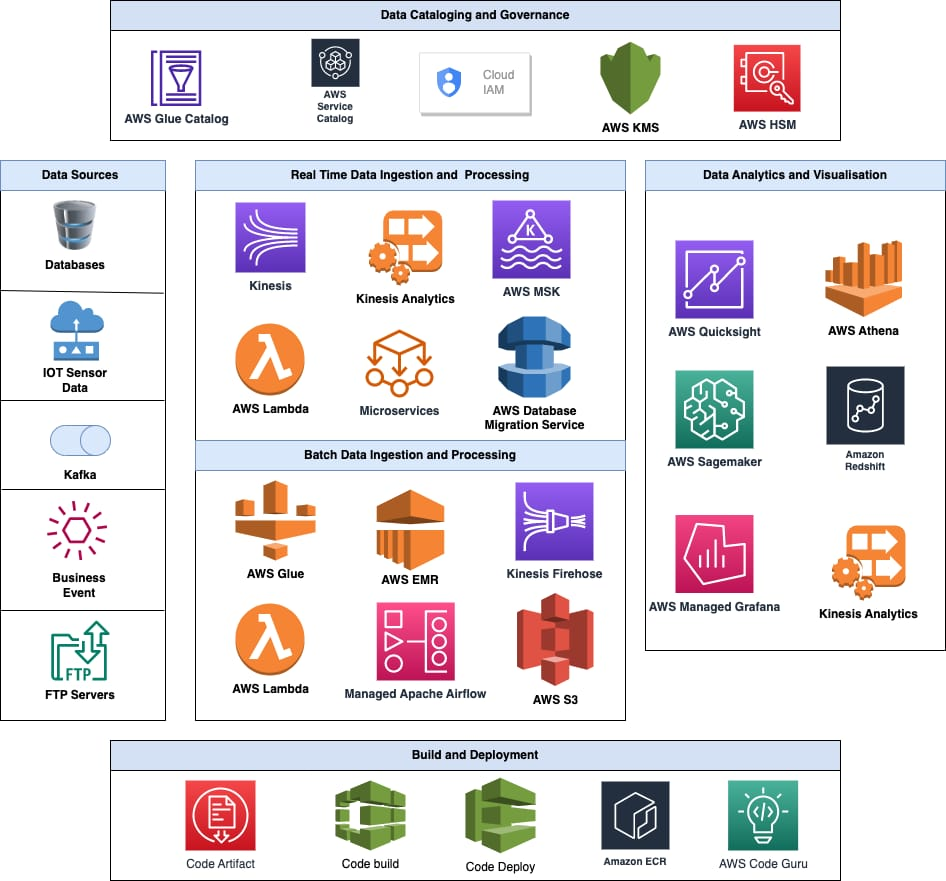

# 3. Data Platform Architecture

Requirement:
Designing a Self service Data platform for user who can share data, write and
orchestrate data delivery pipelines, with no or very less intervention of data platform team.
Data Ingestion for both streaming and Batch data deployment should be done via IaaC as we will be using Agile Methodology.

## Solution
- Data Ingestion
  - Stream data 
  - Batch data
- Data Sharing
- Pipeline Orchestration in real-time
- Data Movement to Various Destinations: reporting and analysis
- Deployment Strategy 

 
AWS Service that can be used
### Data Ingestion
Here, before choosing ingestion tools we should consider certain factors like:
- Data Size
- Freequency : The speed at which data is generated and processed.
- Data Format 
### Data ingestion can happen in two ways mainly:
- Streaming: For streaming data we can use aws Lambda triggers, for example if we have data coming in S3 bucket
the lambda will be triggered, and it will ingest further to our sources.  
For the same task, we could go with streaming tools like Kinesis.  
- Batch Data: For Batch data processing and ingestion we can use AWS glue, which support parallel 
processing using in-memory. One another aspect could be using AWS EMR depending on the needs, if we need 
here, ETL alongside real-time data streaming for ML workloads.

### Data Sharing
As we want to provide user with a service to share data, then we must use some tool in between which 
can act as a data protector layer. 
For example: we can go with opensource tools here.
- Using Apache Atlas and Apache Ranger in a combination we can make solution which will give our user
a Cataloging tools and also security. 
As these are Open source tools and also provides API support, we can make one click solution for Platform user
who can define easily what column of data he wants to hide while sharing/writing data to other sources. 

### Orchestration
For Pipeline Orchestration we can use AWS step function while using AWS glue.
When it comes to some other tools in out data pipeline then we should opt open-source tools like
Airflow, which can hit our manual services to define the progress of pipeline and later which can be shown 
on UI.

### Data Movement 
Data movement facility for Data Platform user without intervention of Data Platform engineer: 
For this Module, We should have predefined Pipelines, or let's say Spark Jobs which can 
pick data from sources and do some processing and show the results of analysis on a graph for instance.
For this we can use Glue to have spark job running there and AWS Lambda, which can trigger the job
based upon user event.

### Deployment Strategy 
We must focus on two aspect here, Tools and Code. Both need to be deployed using CI/CD and iaac tool.
- IaaC: Define microservices infrastructure using Terraform. Manage EC2 instances, security groups, and VPC settings as code.
  So it gives an idea based on Agile Methodology, we can make some changes or add new
microservice while using our CI/CD. We can use Terraform or we also have the option here to use 
AWS cloud formation and CDK.
- CI/CD: For microservice code part our code should be tested before deployment we can use AWS service like 
CodePipeline or when it comes to opensource we can use Jenkins also to have CI/CD solution. 

### Bonus
Consider this as a large scale data platform initiative, describe how you would collaborate with your
Technical Product Owner and fellow data engineers on the data platform team to iteratively ship
high quality data platform tools through agile software delivery methodology
 
#### Disscusion
Define Clear Roles and Responsibilities:  
TPO is the bridge of communication between business stakeholders and the technical team.
 They will ensure that the team is aligned with business priorities and needs. 
 - Produt Vision
 - Clear Requirements 
 
Data Engineer: The data engineers will be responsible for designing, developing, and deploying the platform, 
with a focus on building reusable tools for data ingestion, transformation, orchestration, and data quality.
 - Design architecture: Collaborate with the TPO and other stakeholders to define the technical architecture and 
  select appropriate AWS tools and services.
 - Implement features: Develop the tools and services based on user stories and requirements.
 - Ensure quality: Implement rigorous testing, validation, and monitoring of the platform.
 - Iterate and improve: Continuously improve the platform based on user feedback and changing requirements.
